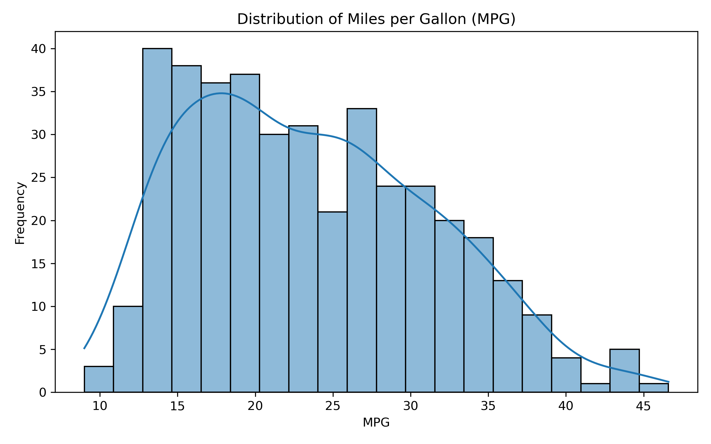
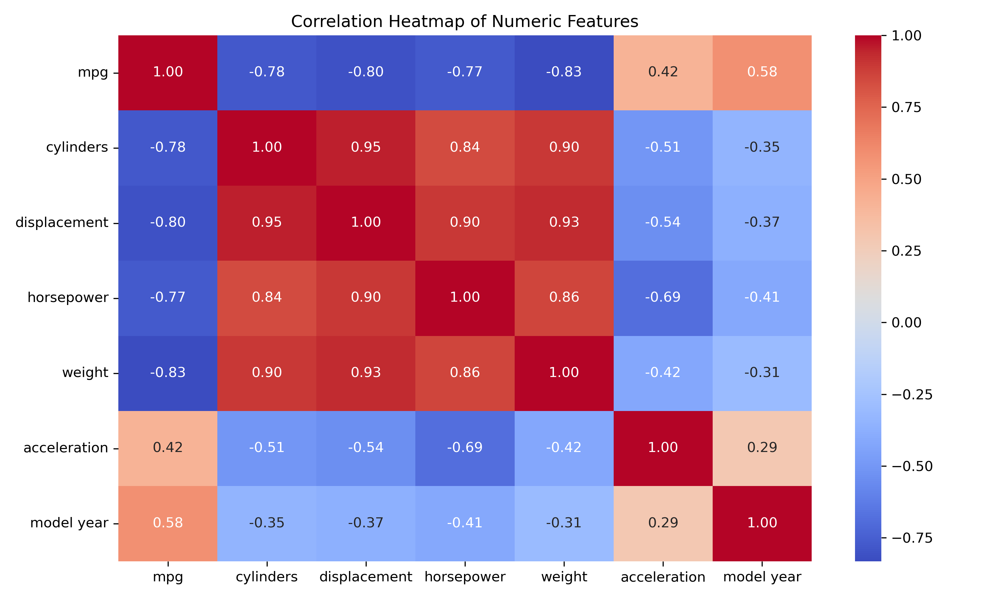

# 🚗 Fuel Economy Analysis

**Objective:**  
Analyze and predict vehicle fuel efficiency (MPG) using historical automotive data from the U.S. market (1970s–1980s).

---

## 📊 Project Overview
This project explores relationships between car attributes (weight, horsepower, model year, etc.) and fuel economy, using data analysis and regression modeling.

**Key Steps:**
1. Data Cleaning & Preparation  
2. Exploratory Data Analysis (EDA)  
3. Correlation & Feature Analysis  
4. Linear Regression Modeling  
5. Ridge Regression (Regularized)  
6. Model Evaluation and Interpretation  

---

## 🧮 Tools & Libraries
- Python 3.11  
- pandas, numpy  
- matplotlib, seaborn  
- scikit-learn, statsmodels  

---

## 🔍 Key Findings
- `weight` has the strongest negative correlation with MPG (**–0.83**)  
- Newer model years show higher MPG (**+0.58 correlation**)  
- Final Multiple Regression R² ≈ **0.82**  
- Ridge regression marginally improved stability  

---

## 📈 Sample Visuals
| MPG Distribution | Correlation Heatmap |
|------------------|----------------------|
|  |  |

---

## 🧠 Insights
- Heavier cars have lower fuel efficiency.  
- Advancements in automotive design (newer model years) significantly improved MPG.  
- Ridge regression can help mitigate multicollinearity between displacement, horsepower, and weight.  

---

## 🧾 Files in Repository
| File | Description |
|-------|--------------|
| `Fuel_Economy_Analysis.ipynb` | Full analysis notebook |
| `Fuel_Economy_Analysis.pdf` | Printable project report |
| `cleaned_auto_mpg.csv` | Clean dataset |
| `correlation_heatmap.png` | Visualization |
| `README.md` | Project overview |

---

## 🧑‍💻 Author
Samrud Shetty  
📧 Email: samruds26@gmail.com  
💼 [LinkedIn Profile]: www.linkedin.com/in/samrud-shetty/

---

### ⭐ Feel free to star this repo if you found it helpful!
